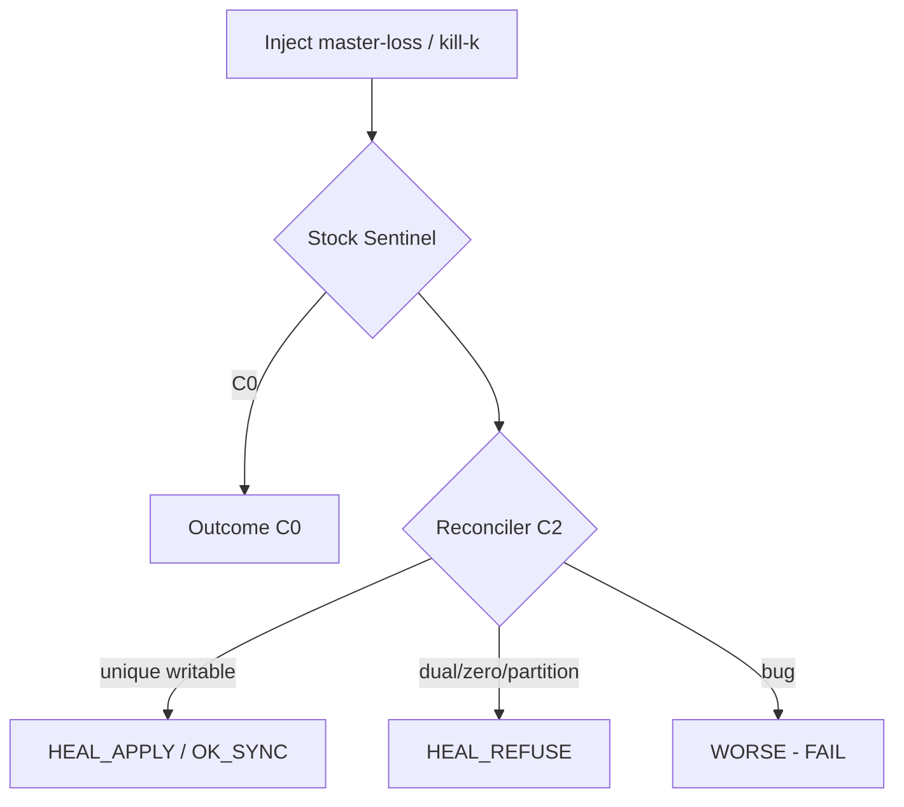

# Matrix schema — outcomes CSV / Markdown

## cell.json

```json
{
  "schema_version": "1",
  "cluster_n": 5,
  "quorum": 3,
  "scenario_id": "A2",
  "kill_k": 1,
  "include_master": true,
  "restore_order": "OLD",
  "reconciler_mode": "C2",
  "phase": "post_restore",
  "writable_count": 1,
  "writable_ips": ["10.0.0.12"],
  "sentinel_ads": {"node-1": "10.0.0.12:6379", "node-2": "10.0.0.12:6379"},
  "ads_agree": true,
  "ad_matches_writable": true,
  "client_set_ok": true,
  "outcome": "OK_SYNC",
  "reconciler_signals": ["heal succeeded"],
  "worse": false,
  "blocked_reason": ""
}
```

## MATRIX.csv columns

```text
scenario_id,cluster_n,reconciler_mode,kill_k,include_master,restore_order,phase,outcome,writable_count,ads_agree,ad_matches_writable,client_set_ok,worse,artifact_dir
```

## Markdown table band (publish)

Rows = scenario (+ kill/restore).  
Columns = `N={3,5,7}` × `mode={C0,C2}` (C1 optional appendix).

Outcome codes: [`PLAN.md`](PLAN.md) §3.

## Mermaid skeleton


